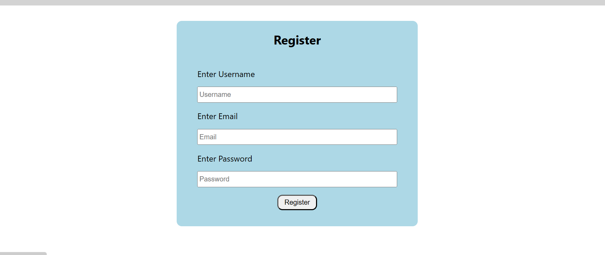
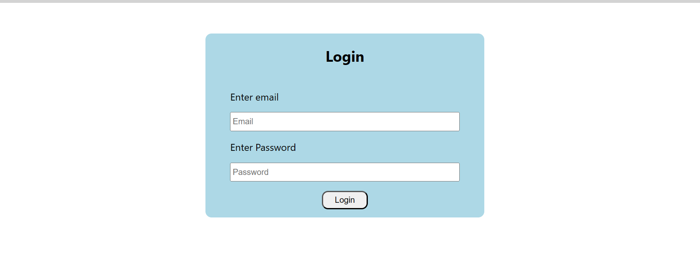
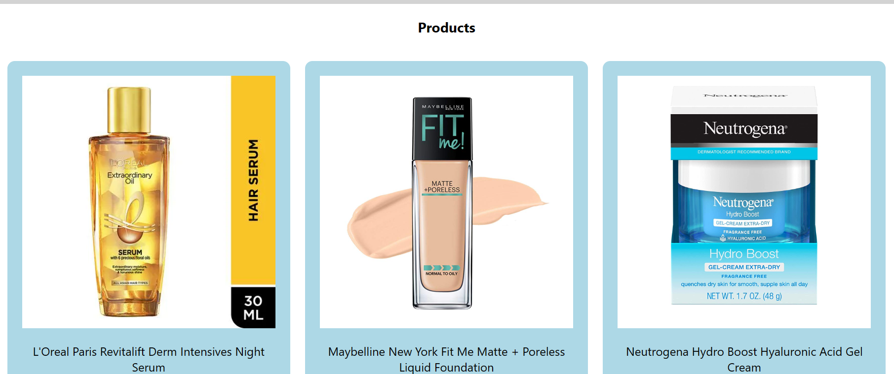
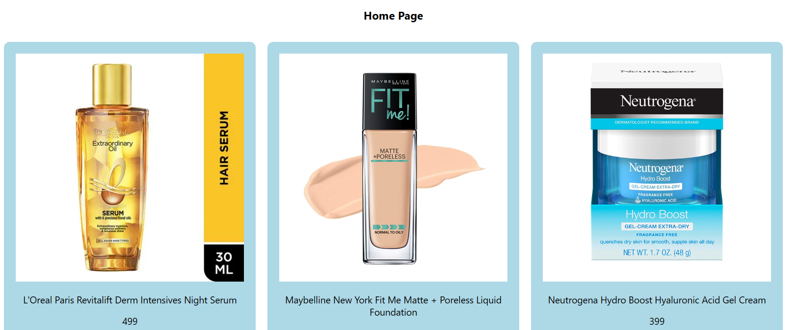

# worldref

### Register page
- Regster form that takes username and password as inputs and store it in localStorage

### Login Page
- Login form that takes username and password as inputs
- Implemented a login function that checks the credentials and sets the authentication status.
- If the login is successful, update the authentication status to true.
- If the login fails, display an alert error message.

### Product page
- Products Page contains card component that displays the card information, including a Title, image, price and description. Product is fetched from backend.
- Implemented two buttons in the card component.
- "Add to Cart" button: Cart page is only accessible to authenticated users. 
- "Check Details" button: Details page is only accessible to authenticated users. 
- Button is disabled for non-authenticated user.

### Home Page
- Home Page contains card component that displays the card information, including a Title, image, price and description.

### Tech Stacks Used
Backend: Express.js || Node.js || MongoDB || mongoose
Frontend: React || Redux || react-redux || react-router-dom || axios || styled-components

### Deployment
Backend Deploy link: https://worldref.onrender.com
- For Product: https://worldref.onrender.com/api/products/

Frontend Deploy link: https://worldref-six.vercel.app/
